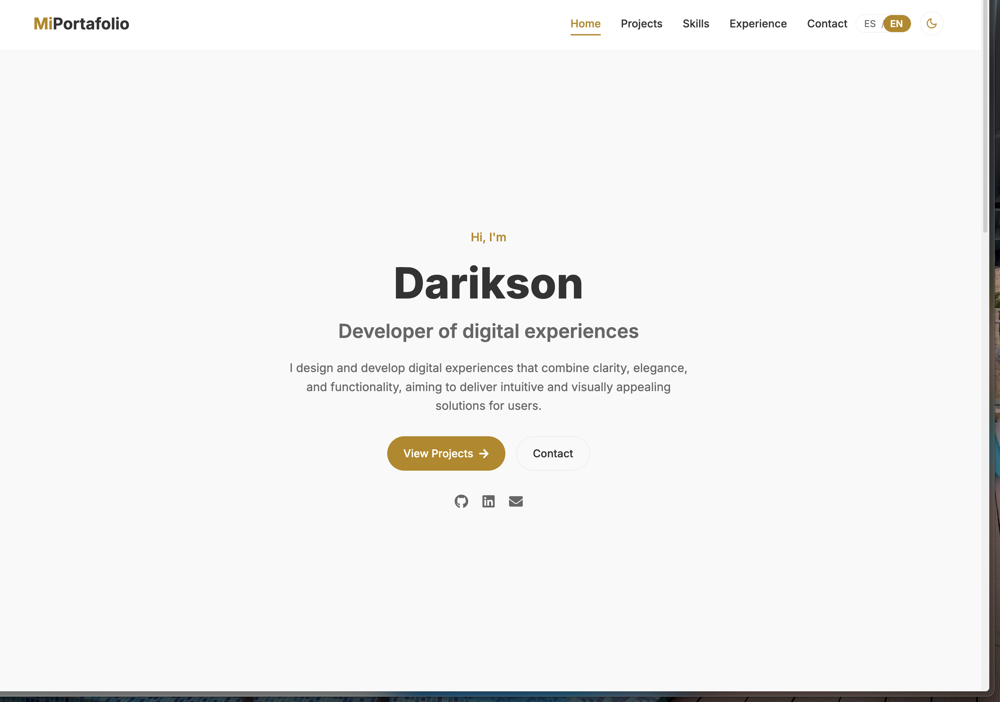
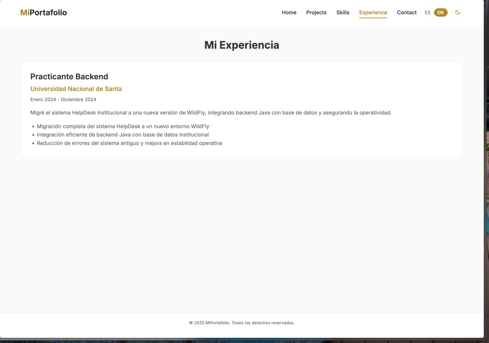
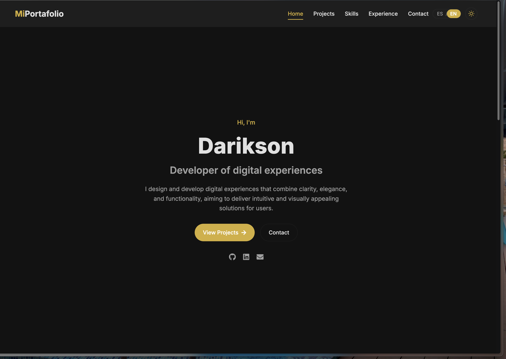
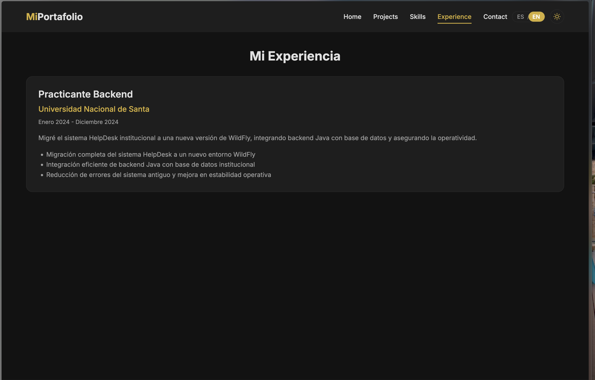

# 🌐 Mi Portafolio - Darikson Anyosa

🚀 Portafolio profesional como desarrollador frontend y backend enfocado en soluciones digitales elegantes, funcionales e intuitivas. Este proyecto refleja mi enfoque en diseño UI/UX, rendimiento y desarrollo moderno con soporte multilenguaje.

## 📸 Capturas de pantalla

### Modo Claro



### Modo Oscuro



## 🧰 Tecnologías Utilizadas

- React
- Styled-Components
- React Router
- Framer Motion
- Context API (para multilenguaje)
- Formspree (formulario de contacto)
- React Icons

## 🌍 Funcionalidades

- ✅ Multilenguaje: Español 🇪🇸 e Inglés 🇺🇸
- ✅ Modo Oscuro / Claro
- ✅ Navegación con React Router
- ✅ Proyectos, habilidades y experiencia
- ✅ Formulario de contacto funcional
- ✅ Responsive Design

## 🛠 Instalación

```bash
git clone https://github.com/tuusuario/mi-portafolio.git](https://github.com/DariksonAnyosa/mi-portafolio-anyosa
cd mi-portafolio
npm install
npm start
```

## 🌐 Deploy a GitHub Pages

```bash
npm install gh-pages --save-dev
```

En `package.json`:

```json
"homepage": "https://tuusuario.github.io/mi-portafolio",
"scripts": {
  "predeploy": "npm run build",
  "deploy": "gh-pages -d build"
}
```

Luego ejecuta:

```bash
npm run deploy
```

## 📬 Contacto

- Email: dariksoma@gmail.com
- LinkedIn: [linkedin.com/in/darikson](https://linkedin.com/)
- GitHub: [github.com/darikson](https://github.com/)

## 📄 Licencia

Este proyecto es de uso personal. Puedes inspirarte para crear el tuyo, pero no lo redistribuyas como propio.
